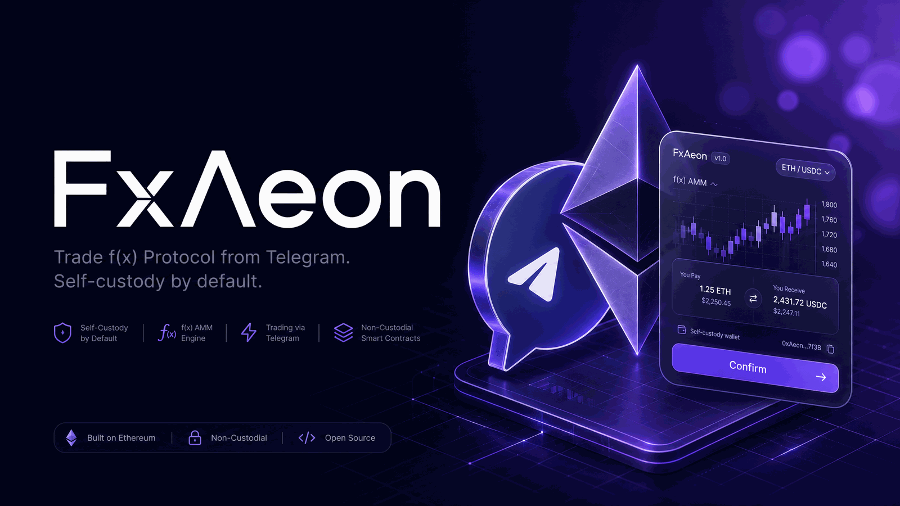
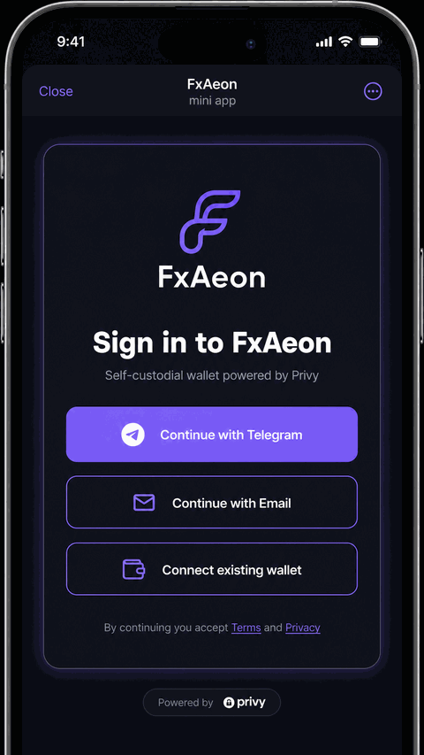
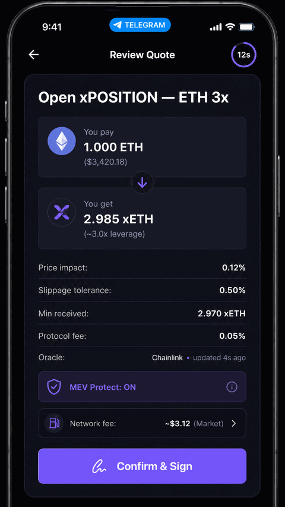
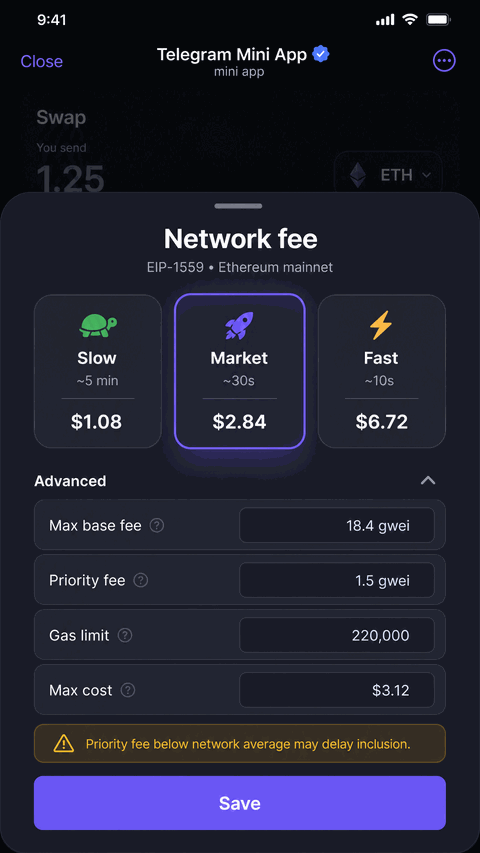
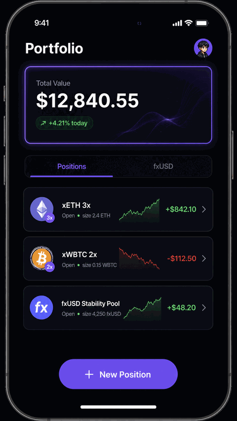
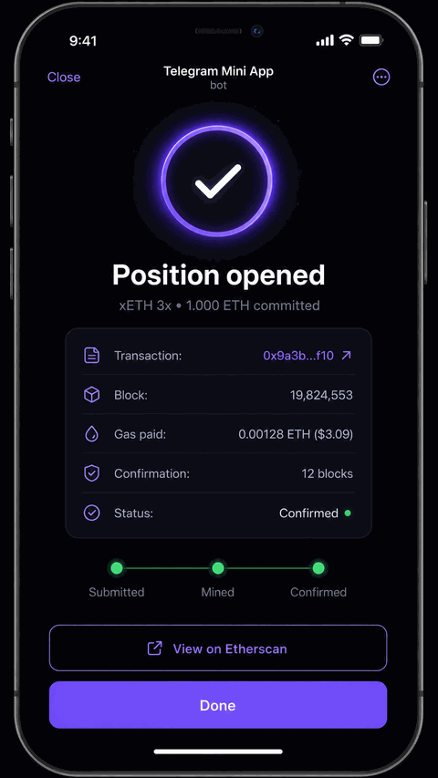
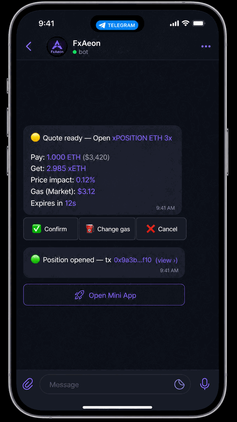
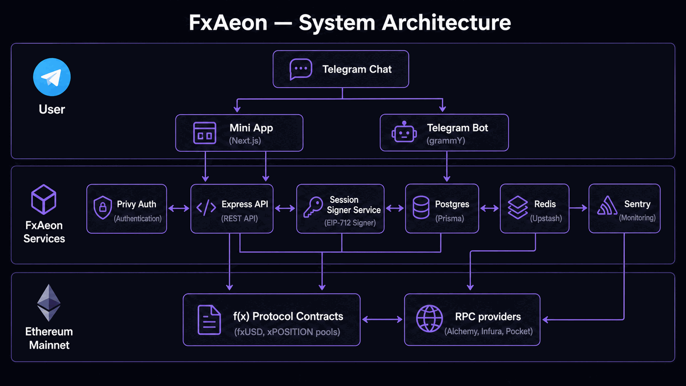

<p align="center">
  
</p>

<h1 align="center">FxAeon</h1>

<p align="center"><b>Trade f(x) Protocol from Telegram. Self-custody by default.</b></p>

<p align="center">
  <a href="https://t.me/FxAeonBot"></a>
  <a href="https://github.com/0xNaeemHassan/FxAeon/actions/workflows/ci.yml"></a>
  
  
  
  
  
  <a href="./LICENSE"></a>
</p>

Telegram DeFi trading bot + Mini App for [f(x) Protocol](https://fx.aladdin.club/) on Ethereum mainnet.

- **Bot:** [@FxAeonBot](https://t.me/FxAeonBot)
- **Wallets:** user-owned [Privy](https://privy.io) embedded wallets — created or imported by the user in the Mini App, with a revocable session-signer grant for bot trading. The server never creates or owns user keys.
- **Stack:** TypeScript · grammY · Next.js (static export) · Prisma/Postgres · Upstash Redis · viem · Sentry

## ✨ Highlights

- 🔐 **Self-custodial** — Privy embedded wallets in a TEE; the server never holds user keys. Bot trading runs on a **revocable, scoped session-signer**.
- 🛡️ **Fail-closed execution** — every bot trade is `simulate`-d before broadcast and checked against an on-chain **signer allow-list** (only f(x) contracts + specific 4-byte selectors can ever be signed).
- ⛽ **Honest EIP-1559 gas** — fees come from `eth_feeHistory` with bigint-only math; no fabricated numbers, simulation shows the real cost before you confirm.
- 🔁 **Idempotent trades** — one idempotency key, one broadcast, ever — safe against Telegram retry storms and worker restarts.
- 🤖 **Trade fxUSD / fxSAVE & xPOSITIONs** and **bridge Ethereum → Base** (LayerZero OFT) without leaving Telegram.
- 🧪 **Tested deeply** — unit, integration, on-chain fork-verify, security and performance suites in CI.

## 🖼️ Screens

<table>
  <tr>
    <td></td>
    <td></td>
    <td></td>
  </tr>
  <tr>
    <td></td>
    <td></td>
    <td></td>
  </tr>
</table>

## 🧱 Architecture

<p align="center"></p>

For the session-signer security model, see <a href="docs/diagrams/security-model.png">docs/diagrams/security-model.png</a> and the [threat model](docs/audit/THREAT_MODEL.md).

## Monorepo layout

```
apps/bot/        grammY Telegram bot + Express API (Render, Docker)
apps/mini-app/   Next.js Telegram Mini App (Cloudflare Pages, static export)
packages/db/     Prisma schema, migrations, client
packages/shared/ f(x) contract addresses, ABIs, types, risk math
ops/runbooks/    incident runbooks (bot down, Privy outage, key compromise, …)
docs/            architecture, deployment, API, audit
scripts/         dev setup, address verification, secret hygiene
```

## 🚀 Quick start (local dev)

```bash
git clone https://github.com/0xNaeemHassan/FxAeon.git
cd FxAeon
./scripts/dev-setup.sh   # copies .env templates, installs deps
# fill in the .env files (see SETUP.md for where each credential comes from)
pnpm dev                 # bot + mini-app via turbo
```

Requires Node 22+ and pnpm 9 (`corepack enable`). Full credential walkthrough: **[SETUP.md](./SETUP.md)**.

## Production

| Component | Target | How |
|---|---|---|
| Bot | Render (Docker web service) | auto-deploy on push to `main` via `render.yaml`; DB migrations run in `deploy.yml` |
| Mini App | Cloudflare Pages | built + deployed by `.github/workflows/deploy-mini-app.yml` |
| DB backups | GitHub Actions → Cloudflare R2 | nightly `backup.yml` (pg_dump 17 → `fxbot-backups` bucket) |

Details: **[docs/DEPLOYMENT.md](docs/DEPLOYMENT.md)**.

## 📚 Documentation

- [Setup guide](./SETUP.md) — accounts, credentials, first deploy
- [Architecture](docs/architecture.md)
- [Deployment](docs/DEPLOYMENT.md)
- [API reference](docs/api.md)
- [External APIs](docs/external-apis.md)
- [Security audit & threat model](docs/audit/)
- [Incident runbooks](ops/runbooks/)
- [Contributing](./CONTRIBUTING.md) · [Security policy](./SECURITY.md) · [Changelog](./CHANGELOG.md)

## 🧪 CI

Every PR runs typecheck, tests (Vitest), an on-chain verification of the contract-address registry, secret scanning (gitleaks), and Lighthouse budgets for the Mini App (`interactive ≤ 4s`). Post-deploy smoke tests hit the live bot.

## 📜 License

[MIT](./LICENSE)
