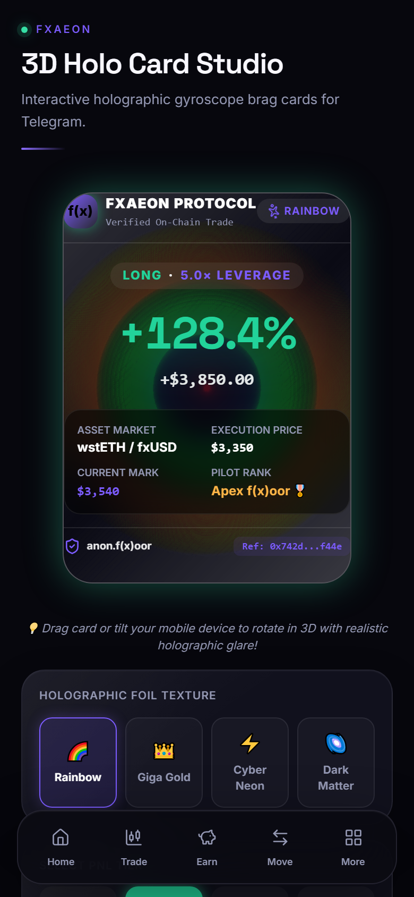
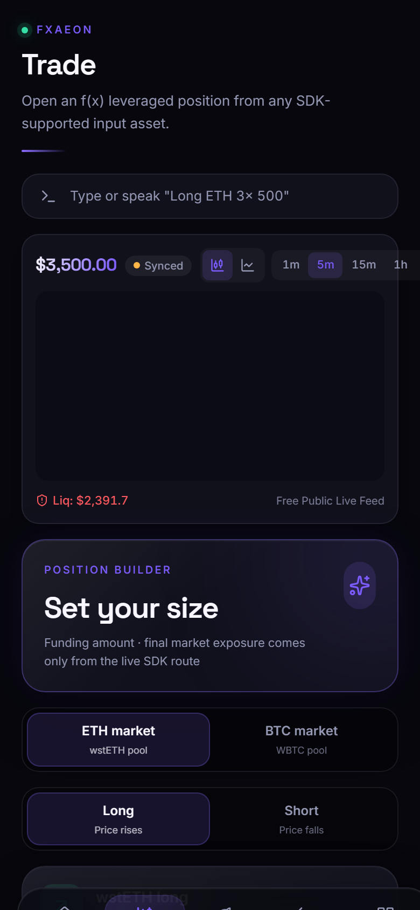
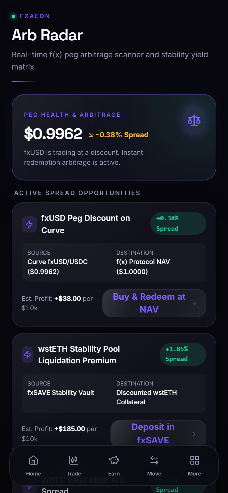
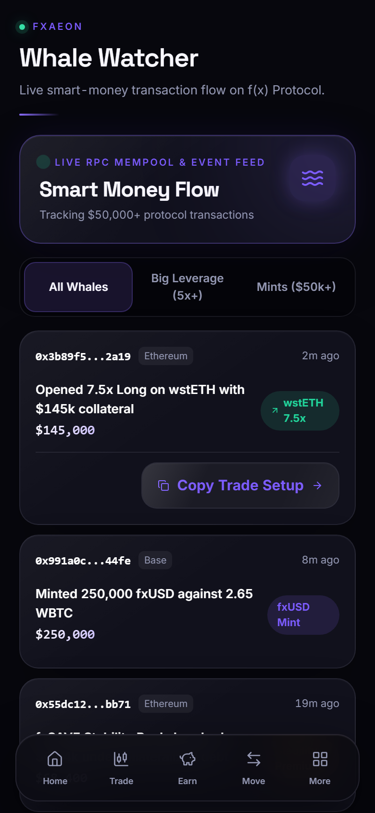
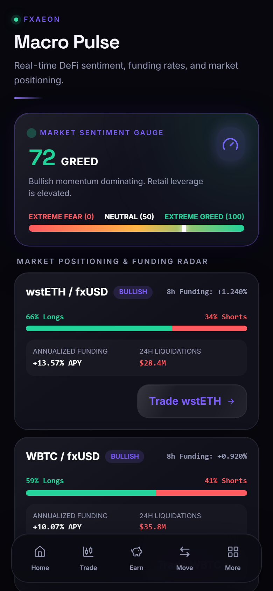
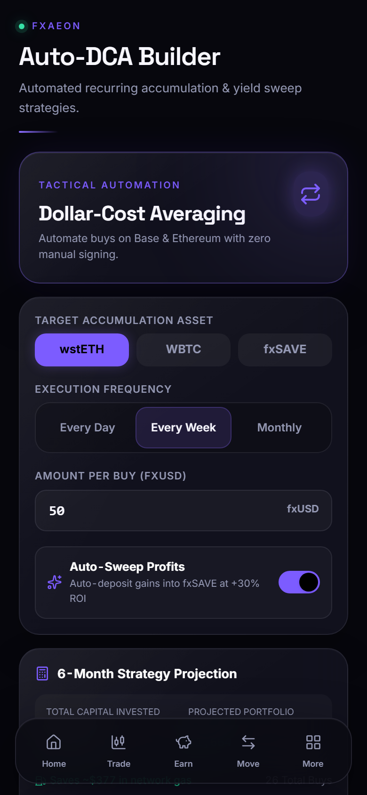
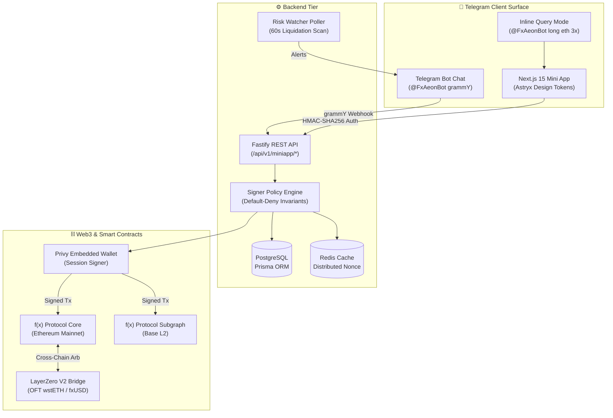

# ⚡ FxAeon: Telegram Non-Custodial Trading Terminal for f(x) Protocol

<div align="center">

[](https://github.com/0xNaeemHassan/FxAeon/actions)
[](https://opensource.org/licenses/MIT)
[](https://www.typescriptlang.org/)
[](https://nextjs.org/)
[](https://astryx.atmeta.com/)
[](https://github.com/0xNaeemHassan/FxAeon)

**The premier decentralized mobile trading terminal built on f(x) Protocol v2.**  
*Instant non-custodial leverage, 3D holographic PnL cards, offline AI voice commentary, real-time peg arb radar, and automated liquidation protection inside Telegram.*

[🚀 Launch Telegram Bot](https://t.me/FxAeonBot) · [🪐 Astryx Design System](docs/ASTRYX_DESIGN_SYSTEM.md) · [🏛️ System Architecture](docs/ARCHITECTURE.md) · [🛠️ Operator Manual](docs/OPERATOR_MANUAL.md) · [📡 API Reference](docs/API_REFERENCE.md)

</div>

---

## 📸 Flagship Visual Showcase

<div align="center">
<table>
  <tr>
    <td align="center"><b>🃏 3D Holographic Gyroscope Cards</b></td>
    <td align="center"><b>📈 High-FPS Canvas 2D Live Terminal</b></td>
  </tr>
  <tr>
    <td></td>
    <td></td>
  </tr>
  <tr>
    <td align="center"><b>⚖️ Stability Arb Radar</b></td>
    <td align="center"><b>🐋 Live Whale Watcher Stream</b></td>
  </tr>
  <tr>
    <td></td>
    <td></td>
  </tr>
  <tr>
    <td align="center"><b>📡 Macro Pulse & Sentiment Radar</b></td>
    <td align="center"><b>📈 Auto-DCA Strategy Builder</b></td>
  </tr>
  <tr>
    <td></td>
    <td></td>
  </tr>
</table>
</div>

---

## 🌟 Key Innovations & Feature Matrix

### 1. 🪐 Meta Astryx Design System Architecture
* **Agent-Ready Design Tokens**: Built following Meta's open-source **Astryx** and **StyleX** design principles with an accessible CSS Custom Property token cascade across surfaces, elevations, specular rim lighting, and spring physics.
* **4 OLED Theme Palettes**: Deep Space Violet, Matrix Terminal, Neon Velocity, and Monochrome Titanium with instant client-side switching.

### 2. 🃏 3D Holographic Gyroscope PnL Flex Cards (`/card`)
* **Gyroscope & Touch Parallax**: Responds in real-time to physical mobile phone tilting (`DeviceOrientationEvent`) and pointer dragging.
* **4 Collectible Foil Shaders**: Rainbow Chromatic, Giga Gold, Cyber Neon, and Dark Matter Obsidian.
* **1-Tap Social Export**: Direct publishing to Telegram Stories and Chat DMs.

### 3. 🎙️ Native Cyberpunk Voice Announcer Engine
* **100% Zero-Cost Local TTS**: Client-side speech synthesis using browser `speechSynthesis` with zero API fees or latency.
* **3 Tactical Personas**: Cyberpunk AI 🤖, Hype Desk Announcer 🔥, and Zen Master 🧘.
* **Audible Triggers**: Real-time voice alerts for trade fills, Take-Profit targets, Stop-Loss triggers, and whale liquidation alerts.

### 4. 🕹️ Pro Trading Terminal & Canvas 2D Charts (`/trade`)
* **60fps HTML5 Canvas Engine**: Candlestick & Area charts with live WebSocket ticker updates.
* **Interactive Overlays**: Draggable Take-Profit / Stop-Loss lines with dynamic Risk/Reward ratios.
* **Speech-to-Trade Copilot Bar**: Voice recognition and regex command parser for hands-free trading.

### 5. ⚖️ Stability Arb Radar (`/radar`)
* Real-time monitoring of fxUSD secondary market discounts vs on-chain 1:1 NAV redemption value.
* Instant profit-per-$10k calculation with 1-tap arbitrage execution.

### 6. 🐋 Live Whale Watcher Stream (`/whales`)
* Real-time smart-money protocol transaction feed ($50k+ mints, burns, and leverage positions).
* 1-Tap "Copy Trade Setup" mirroring leverage and market direction.

### 7. 📈 Auto-DCA & Tactical Grid Builder (`/dca`)
* Automated recurring asset accumulation on Base & Ethereum Mainnet.
* Automatic profit sweep to yield-bearing fxSAVE vault upon achieving target ROI (+30%).

### 8. 🛡️ Non-Custodial Session Signer Gate
* **Privy Session Delegation**: Eliminates repetitive wallet popups while preserving non-custodial ownership.
* **Default-Deny Policy Boundary**: Verifies target contract whitelists, slippage boundaries (max 200 bps), and token approvals.

---

## 🏛️ System Architecture


```mermaid
graph TD
    subgraph Telegram_Client["📱 Telegram Client Surface"]
        TMA["Next.js 15 Mini App\n(Astryx Design Tokens)"]
        TBOT["Telegram Bot Chat\n(@FxAeonBot grammY)"]
        INLINE["Inline Query Mode\n(@FxAeonBot long eth 3x)"]
    end

    subgraph Backend_Infrastructure["⚙️ Backend Tier"]
        API["Fastify REST API\n(/api/v1/miniapp/*)"]
        GUARD["Signer Policy Engine\n(Default-Deny Invariants)"]
        POL["Risk Watcher Poller\n(60s Liquidation Scan)"]
        DB[(PostgreSQL\nPrisma ORM)]
        REDIS[(Redis Cache\nDistributed Nonce)]
    end

    subgraph Web3_Protocols["⛓️ Web3 & Smart Contracts"]
        PRIVY["Privy Embedded Wallet\n(Session Signer)"]
        FX_CORE["f(x) Protocol Core\n(Ethereum Mainnet)"]
        FX_BASE["f(x) Protocol Subgraph\n(Base L2)"]
        LZ["LayerZero V2 Bridge\n(OFT wstETH / fxUSD)"]
    end

    TMA -->|HMAC-SHA256 Auth| API
    TBOT -->|grammY Webhook| API
    INLINE --> TMA
    API --> GUARD
    GUARD --> PRIVY
    GUARD --> DB
    GUARD --> REDIS
    POL -->|Alerts| TBOT
    PRIVY -->|Signed Tx| FX_CORE
    PRIVY -->|Signed Tx| FX_BASE
    FX_CORE <-->|Cross-Chain Arb| LZ
```

---

## 🚀 Quick Start Guide

### Prerequisites
* **Node.js**: >= 20.0.0
* **pnpm**: >= 9.0.0
* **PostgreSQL**: >= 15.0

### 1. Installation & Environment Setup
```bash
git clone https://github.com/0xNaeemHassan/FxAeon.git
cd FxAeon
pnpm install
cp apps/bot/.env.example apps/bot/.env
```

### 2. Database Migration & Prisma Generation
```bash
pnpm --filter @fxaeon/db prisma migrate dev
```

### 3. Run Development Server
```bash
pnpm dev
```
* **Mini App**: `http://localhost:3000`
* **Bot API**: `http://localhost:3001`

---

## 🧪 Comprehensive Verification & Testing

The repository maintains an exhaustive automated test suite covering units, integration flows, mathematical risk models, and adversarial signer constraints:

```bash
# Run all 750 unit and integration tests
pnpm test

# Run monorepo typecheck
pnpm typecheck

# Run Next.js production build (24 static routes)
pnpm build
```

* **Bot Test Suite**: **719 / 719 tests passing** across 70 test files.
* **Mini App Test Suite**: **31 / 31 tests passing** across all math, algo, and locale catalogs.
* **Next.js Prerender**: **24 / 24 static routes** compiled with 0 errors and 0 ESLint warnings.

---

## 📚 Technical Documentation Suite

* [🪐 **Astryx Design System Matrix**](docs/ASTRYX_DESIGN_SYSTEM.md) — Comprehensive guide to Astryx tokens, elevation hierarchy, spring physics, and component contracts.
* [🏛️ **System Architecture & Security Specification**](docs/ARCHITECTURE.md) — Deep dive into session delegation, security invariants, and smart contract orchestration.
* [🛠️ **Production Operator Manual**](docs/OPERATOR_MANUAL.md) — Step-by-step deployment guide for Docker, Render cloud, Telegram BotFather, and health monitoring.
* [📡 **API & Integration Reference**](docs/API_REFERENCE.md) — Machine-readable Fastify REST endpoint specs, HMAC initData verification, and WebSocket feeds.
* [📸 **High-DPI Visual Gallery**](docs/ASTRYX_DESIGN_SYSTEM.md) — Complete 18-screen visual catalog.

---

## 📄 License

Distributed under the **MIT License**. See `LICENSE` for details.
