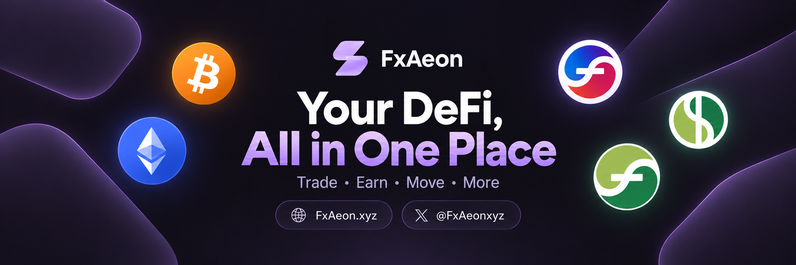

<div align="center">
  

  <p>Trade ETH and BTC positions, borrow fxUSD, manage fxSAVE, and move supported assets between Ethereum and Base.</p>

  <p>
    <a href="https://github.com/0xNaeemHassan/FxAeon/actions/workflows/ci.yml"></a>
    <a href="https://github.com/0xNaeemHassan/FxAeon/actions/workflows/e2e-mini-app.yml"></a>
    <a href="https://github.com/0xNaeemHassan/FxAeon/actions/workflows/supply-chain.yml"></a>
    <a href="https://github.com/0xNaeemHassan/FxAeon/actions/workflows/anvil-fork.yml?query=branch%3Amain+event%3Aworkflow_dispatch"></a>
    <a href="LICENSE"></a>
  </p>

  <p>
    <a href="https://fxaeon.com/">Open the app</a> ·
    <a href="https://fxaeon.xyz/">Visit FxAeon</a> ·
    <a href="docs/README.md">Documentation</a>
  </p>
</div>

## FxAeon

FxAeon is a browser and Telegram Mini App built with the official f(x) SDK. The financial app is a static client: protocol reads and plans use the pinned SDK, and the user's wallet approves each transaction. The separate marketing site at [fxaeon.xyz](https://fxaeon.xyz/) links to the app at [fxaeon.com](https://fxaeon.com/).

<p align="center">
  
  <br />Fork-backed positions; displayed prices and charts are illustrative. See <a href="docs/position-screenshot-fixture.md">capture provenance</a>.
</p>

### Features

- **Positions:** view and manage Ethereum ETH/BTC long and short positions, including open, increase, reduce, close, and leverage adjustment.
- **Borrow:** add long collateral and borrow fxUSD, or repay fxUSD and withdraw collateral.
- **Earn:** deposit into fxSAVE, track queued redemptions, and claim when ready.
- **Move:** bridge supported fxUSD and fxSAVE between Ethereum and Base.
- **Portfolio:** review wallet assets and positions with explicit unavailable, partial, and zero states.

The product exposes exactly 15 approved f(x) SDK methods. The checked-in [`fx-scope.lock.json`](fx-scope.lock.json) and [`docs/sdk-scope.md`](docs/sdk-scope.md) define that boundary.

### Transaction safety

- The selected Privy or browser wallet is the only signing authority; FxAeon does not handle private keys or submit transactions from a server.
- The runner validates and simulates the reviewed route before wallet requests, asks for a separate confirmation for each step, and waits for a verified receipt before continuing.
- Ethereum is authoritative for positions, borrowing, and fxSAVE. Bridge source confirmation and destination delivery are tracked separately.
- USD prices and charts are display context only. They do not affect planning or signing. Position value is not P&L, ROI, or liquidation value.
- The only optional server-side feature is the read-only `/api/gas` Pages Function; it cannot plan, sign, or establish protocol state.

FxAeon is unaudited application software for financial transactions. Review each request in your wallet and use the software at your own risk. See [`SECURITY.md`](SECURITY.md) and [`docs/security.md`](docs/security.md).

### Architecture

```mermaid
flowchart LR
    WEB[Browser] --> APP[Static Next.js app]
    TG[Telegram Mini App] --> APP
    APP --> SDK[Pinned f(x) SDK]
    APP --> RPC[Read-only Ethereum and Base RPC]
    APP --> WALLET[User-selected wallet]
    SDK --> ETH[Ethereum]
    WALLET --> ETH
    WALLET --> BASE[Base]
    ETH <--> LZ[LayerZero]
    BASE <--> LZ
    APP -. display only .-> PRICES[Validated price feeds]
```

Protocol actions run in the client. The only server endpoint is the optional, read-only `/api/gas` Pages Function described above. There is no database, delegated signer, or background executor. See [architecture](docs/architecture.md) for module and data ownership.

## Quick start

Requirements: Node.js 22 and pnpm 11.19.0 through Corepack.

```bash
corepack enable
corepack prepare pnpm@11.19.0 --activate
pnpm install --frozen-lockfile
cp apps/mini-app/.env.example apps/mini-app/.env.local
pnpm dev
```

Open <http://localhost:3000>. Portfolio is the first screen. A Privy app ID enables Privy login; without it, users can connect an injected EVM wallet. Configure restricted Ethereum and Base Alchemy endpoints before testing protocol reads. All `NEXT_PUBLIC_*` values are included in the browser bundle; never put signing secrets or a Telegram bot token there.

See [SETUP.md](SETUP.md) for environment variables and local testing, and [deployment](docs/deployment.md) for Cloudflare Pages configuration.

## Verification

Run the repository's complete credential-free checks:

```bash
pnpm verify
```

The protected Anvil tests use disposable local accounts and require an operator-supplied Ethereum fork endpoint. They never use production funds:

```bash
pnpm test:anvil:all
pnpm test:anvil:browser
```

See [testing](docs/testing.md) for the CI gates, browser suite, and fork setup.
Production browser tests and the isolated Borrow, overlay, and UI state lab
suites have separate commands; the lab is development-only. See the
[browser test gates](docs/browser-test-gates.md) and [UI state lab guide](docs/ui-state-lab.md).

## Documentation

| Guide | Purpose |
| --- | --- |
| [Setup](SETUP.md) | Install, configure, and run locally |
| [Contributing](CONTRIBUTING.md) | Change workflow and review expectations |
| [Architecture](docs/architecture.md) | Runtime boundaries and data ownership |
| [Security](docs/security.md) | Threat model and controls |
| [SDK scope](docs/sdk-scope.md) | Locked protocol capability contract |
| [Testing](docs/testing.md) | CI, browser, and protected fork checks |
| [Browser test gates](docs/browser-test-gates.md) | Production browser suite and isolated harness commands |
| [UI state lab](docs/ui-state-lab.md) | Development-only deterministic component and receipt fixtures |
| [Deployment](docs/deployment.md) | App and landing Pages projects |
| [Brand and capture provenance](docs/brand-assets.md) | Marks, themes, and checked-in screenshots |

The searchable, read-only product guide is available in the app under **More → FxAeon docs**.

## License

FxAeon is available under the [MIT License](LICENSE).
