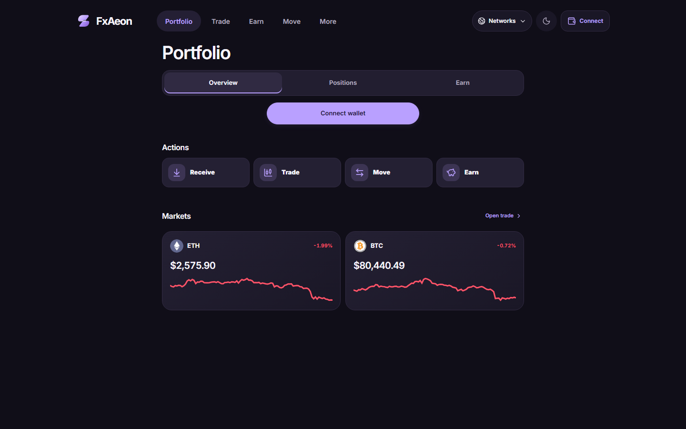
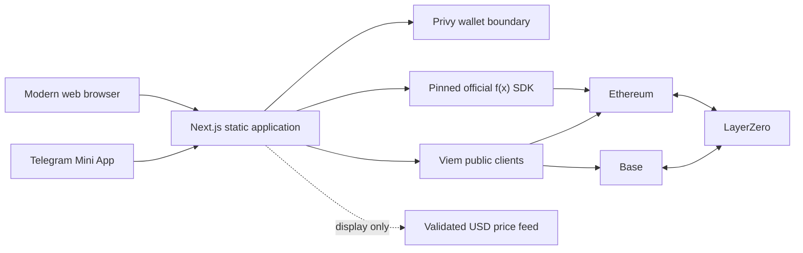

<div align="center">
  

  <p>
    Trade positions, borrow fxUSD, manage fxSAVE on Ethereum, and move supported assets between Ethereum and Base<br />
    from the web or Telegram.
  </p>

  <p>
    <a href="https://github.com/0xNaeemHassan/FxAeon/actions/workflows/ci.yml"></a>
    <a href="https://github.com/0xNaeemHassan/FxAeon/actions/workflows/e2e-mini-app.yml"></a>
    <a href="https://github.com/0xNaeemHassan/FxAeon/actions/workflows/supply-chain.yml"></a>
    <a href="https://github.com/0xNaeemHassan/FxAeon/actions/workflows/anvil-fork.yml?query=branch%3Amain+event%3Aworkflow_dispatch"></a>
    <a href="LICENSE"></a>
  </p>

  <p>
    <a href="https://fxaeon.com/">Open FxAeon app</a> ·
    <a href="https://fxaeon.xyz/">FxAeon home</a> ·
    <a href="docs/README.md">Docs</a>
  </p>

  <p>
    <a href="#product">Product</a> ·
    <a href="#security-by-construction">Security</a> ·
    <a href="#architecture">Architecture</a> ·
    <a href="#quick-start">Quick start</a> ·
    <a href="#verification">Verification</a> ·
    <a href="docs/README.md">Documentation</a> ·
    <a href="docs/README.md#user-guide">User guide</a>
  </p>
</div>

---

## Product



<table>
  <tr>
    <td width="50%" align="center">
      
      <br /><strong>Ethereum ↔ Base bridge workflow</strong>
    </td>
    <td width="50%" align="center">
      
      <br /><strong>Trade</strong>
    </td>
  </tr>
  <tr>
    <td width="50%" align="center">
      
      <br /><strong>Mobile Trade workspace</strong>
    </td>
    <td width="50%" align="center">
      
      <br /><strong>Mobile Portfolio · light</strong>
    </td>
  </tr>
  <tr>
    <td width="50%" align="center">
      
      <br /><strong>Token selection</strong>
    </td>
    <td width="50%" align="center">
      
      <br /><strong>Standalone browser wallet setup</strong>
    </td>
  </tr>
  <tr>
    <td width="50%" align="center">
      
      <br /><strong>Portfolio · browser fork capture</strong>
    </td>
    <td width="50%" align="center">
      
      <br /><strong>Long or short. One position workspace.</strong>
    </td>
  </tr>
</table>

Standard UI captures document prior builds. The four populated position screenshots were refreshed from the successful browser gate at block `25965421`; their [manifest](docs/fixtures/position-screenshot-manifest.json) records the rendered states and visibly labelled illustrative prices/charts. They show fork-backed positions, not production balances or real market prices. See [capture provenance](docs/position-screenshot-fixture.md). [Mobile positions](docs/assets/fxaeon-positions-mobile.png) · [Connected Trade](docs/assets/fxaeon-trade-connected.png).

### Capabilities

| Capability | What FxAeon provides |
| --- | --- |
| Positions | Read ETH/BTC long and short positions on Ethereum; open, increase, reduce, close, and adjust leverage from a responsive master-detail workspace with a direct Close action on every position |
| Borrow | Deposit collateral and mint fxUSD on Ethereum; repay debt and withdraw collateral |
| fxSAVE | Read Ethereum balances/configuration, deposit assets, queue or execute redemptions, and claim completed withdrawals; verified zero-share balances remain exact zero |
| Bridge | Quote and build Ethereum ↔ Base LayerZero routes with source-receipt and destination-GUID verification |
| Market price context | Timestamp- and confidence-validated current asset prices across forms, pickers, Portfolio, Earn, positions, and the wallet profile, plus validated ETH/BTC market history for charts; display-only and never an execution input |
| Wallet profile | Privy embedded wallets or browser-injected EVM wallets, supported-asset balances with per-asset USD values, dedicated History, and in-place connect/disconnect/account switching—without a custody server |
| Shared wallet data | Wagmi and TanStack Query keep balances consistent across Portfolio, token pickers, and Move, with account-scoped caching and receipt-backed refreshes; Portfolio shows a known USD subtotal for incomplete reads and a full total only when valuation is complete |
| Recovery | Reload-safe pending transaction and bridge journals in a dedicated History view, always revalidated against chain data |
| Interface | Mobile-first controls, searchable token pickers with available quantities and their USD worth, a real leverage slider, and official, neutral-dark, and light themes |

The public SDK surface is limited to 15 methods. [`fx-scope.lock.json`](fx-scope.lock.json) and the scope verifier enforce that boundary.

Token and network marks use maintained AladdinDAO/SmolDapp assets (with local SVG fallbacks), so fxUSD, fxSAVE, ETH, WETH, stETH, wstETH, USDC, USDT, BTC, Ethereum, and Base remain recognizable even when an asset host is unavailable.

### Key boundaries

- **Wallet control.** Privy or the connected external wallet is the signing authority; FxAeon never accepts a private key.
- **Protocol scope.** Reads and unsigned plans use the pinned <code>@aladdindao/fx-sdk</code>. Ethereum is authoritative for positions, Borrow, and fxSAVE; Ethereum/Base receipts and LayerZero events establish bridge state.
- **Price context.** Validated DefiLlama and CoinGecko data supports display values and charts. It is isolated from planning, simulation, and signing.
- **Action review.** Connected inputs can show read-only details. The primary action rebuilds, validates, and simulates against current state before opening the wallet; material changes require another explicit action.
- **Hosting.** The app is a static Cloudflare Pages export. An optional read-only `/api/gas` function cannot sign or establish protocol state.

## Security by construction

Every write follows the same guarded lifecycle:

1. build a fresh plan from current wallet, chain, and form inputs;
2. bind it to the selected sender and supported network;
3. validate destinations, selectors, calldata shape, value, approvals, nonce, and order;
4. simulate the ordered calls when supported;
5. show human-readable and raw transaction details before the wallet prompt;
6. request a visible wallet confirmation for each step only after the explicit action;
7. wait for a successful, fingerprint-matching receipt before continuing;
8. wait for one canonical confirmation by default, then reread the receipt and authoritative protocol state; deeper confirmation depth is explicit.

A rejection, revert, timeout, provider inconsistency, or nonce drift stops the route. Bridge source confirmation is never presented as destination delivery.

> [!IMPORTANT]
> FxAeon is unaudited application software for financial transactions. Review the transaction details shown by your wallet and use the software at your own risk. See [`SECURITY.md`](SECURITY.md) and [`docs/security.md`](docs/security.md) for the complete security model.

## Architecture


```mermaid
flowchart LR
    WEB[Modern web browser] --> APP
    TG[Telegram Mini App] --> APP[Next.js static application]
    APP --> PRIVY[Privy wallet boundary]
    APP --> SDK["Pinned official f(x) SDK"]
    APP --> VIEM[Viem public clients]
    APP -. display only .-> USD[Validated USD price feed]
    SDK --> ETH[Ethereum]
    VIEM --> ETH
    VIEM --> BASE[Base]
    ETH <--> LZ[LayerZero]
    BASE <--> LZ
```

| Layer | Responsibility |
| --- | --- |
| Interface | Responsive web/Telegram navigation, forms, inline action details, in-place wallet controls, recovery, and accessible states |
| Wallet boundary | Authentication, wallet selection, chain switching, and explicit transaction prompts |
| SDK façade | The exact 15-method official capability contract |
| Policy and runner | Plan binding, validation, simulation, serialization, receipts, and authoritative refresh |
| Chain clients | Restricted Ethereum/Base RPC reads, simulations, receipts, and bridge-event verification |
| Price context | Read-only USD display values with timestamp/confidence validation; never used by execution policy |
| Hosting | Pure static assets with generated CSP hashes and reviewed network destinations |

Read the detailed runtime and state-ownership model in [`docs/architecture.md`](docs/architecture.md).

## Quick start

### Requirements

- Node.js 22
- pnpm 11.19.0 through Corepack

### Install and run

```bash
corepack enable
corepack prepare pnpm@11.19.0 --activate
pnpm install --frozen-lockfile
cp apps/mini-app/.env.example apps/mini-app/.env.local
pnpm dev
```

Open <http://localhost:3000> in a browser. The financial app opens Portfolio at `/`; `/portfolio` remains a compatibility alias. Wallet connection, account switching, and disconnect happen in place from the app shell and wallet panel; `/login` remains an explicit standalone setup screen. The independent marketing site is served from `apps/landing` when needed. Telegram is optional for local development; use a Telegram test launch only when validating host-specific viewport, theme, haptic, or seamless-login behavior.

### Public build configuration

| Variable | Purpose |
| --- | --- |
| `NEXT_PUBLIC_PRIVY_APP_ID` | Public Privy application identifier; required for Privy/Telegram authentication and optional only when using an injected browser wallet |
| `NEXT_PUBLIC_ALCHEMY_ETHEREUM_RPC_URL` | Origin-restricted Ethereum browser endpoint |
| `NEXT_PUBLIC_ALCHEMY_BASE_RPC_URL` | Origin-restricted Base browser endpoint |
| `NEXT_PUBLIC_ALCHEMY_DATA_API_KEY` | Origin-restricted Alchemy Data API key for foreground Ethereum/Base asset discovery |
| `NEXT_PUBLIC_TELEGRAM_APP_URL` | Secondary Telegram launch link; browser entry does not depend on it |

Every `NEXT_PUBLIC_*` value is embedded in the browser bundle. Never place a private key, Telegram bot token, Privy secret, authorization key, or unrestricted provider credential in client configuration. Without Privy, FxAeon connects directly to the wallet extension through EIP-1193; signing still happens in that wallet and no fallback server is involved.

Cloudflare Pages must receive the same public build variables as the release build; GitHub Actions secrets are not implicitly inherited by a native Pages Git build. The deployment workflow checks the live public Privy configuration after Pages publishes, then synchronizes the Telegram bot profile and Mini App menu with the protected `TELEGRAM_BOT_TOKEN`. The bot token is never shipped to the browser.

See [`SETUP.md`](SETUP.md) for provider restrictions, protected deployment variables, fork-test configuration, and Cloudflare Pages deployment.

## Verification

```bash
pnpm verify
```

The release gate includes:

- exact SDK scope and route-boundary verification;
- ESLint and strict TypeScript checks;
- unit and adversarial money-path tests;
- seeded route and wallet-runner chaos campaigns;
- high-severity production dependency audit;
- static Next.js export and CSP generation;
- bundle-size and forbidden-telemetry inspection; and
- Playwright coverage against the built artifact.

For additional commands:

```bash
pnpm test:chaos   # deterministic mutation and failure-injection campaigns
pnpm test:anvil   # real ETH/BTC long/short positions on a protected mainnet fork
pnpm test:anvil:earn # real fxSAVE deposits, withdrawal paths, cooldown and claim
pnpm test:anvil:stress # fast dummy-route transport stress on the fork
pnpm test:anvil:all    # position, stress and Earn proofs serially in one node
pnpm test:anvil:browser # open and fully close all four positions through the mobile browser UI
pnpm test:stress  # credential-free chaos plus protected dummy-route fork stress
pnpm test:e2e     # browser and Telegram-sized static-artifact coverage
```

Anvil uses disposable local accounts and snapshots. The default proof funds an unlocked account with fork-only USDC impersonation, opens coexisting ETH/BTC long and short positions through the official SDK, then deposits additional collateral and borrows real fxUSD against the existing ETH long. It verifies that the same position ID is preserved, debt increases, and the borrowed fxUSD reaches the wallet. It then reverts the snapshot and emits `artifacts/anvil/protocol-proof.json`. Its upstream provider URL is supplied only to the Anvil parent process and is never committed, printed, forwarded to the test child, or written to the proof artifact.

The manual **Protected Anvil mainnet fork** workflow runs four gates: the Node four-position proof, the fxSAVE Earn lifecycle proof, 64 snapshot/revert plus 64 dummy ordered-route stress iterations, and real position opening plus full closing through the mobile browser UI. The browser gate checks inline action facts, final rebuild/simulation before signing, immediate approval/action explorer links, receipt-verified positions before indexing, reload recovery, direct close actions, receive-token balances, zeroed pool accounting after every close, and shared position views across Trade, Positions, Portfolio, Earn, and Move. It captures the populated interface, proves the honestly empty state after closing all four positions, then restores the snapshot.

The protected workflow uses the Ethereum Alchemy URL stored in the GitHub environment. A dispatch input or protected `ANVIL_FORK_BLOCK` repository variable can pin the release block. The badge follows the latest completed manual run on `main`: all four gates must pass for this workflow revision to be green. An older green run without the Earn or enhanced browser checks does not prove those paths. See [testing and proof artifacts](docs/testing.md) and [screenshot provenance](docs/position-screenshot-fixture.md).

The final browser proof manifest records the four-position open/borrow/close
lifecycle at fork block `25965421` and restored snapshot. The promoted position
screenshots use visibly labelled illustrative display data; the separate
node-runner command is available for rendering fork state without browser
transaction execution.

Final verification completed across separate runs. The aggregate log
`%TEMP%/fxaeon-final-release-verify-latest.log` records `380` source/unit checks
(`376` passed, `4` skipped) and passing build/export, typecheck, bundle,
frontend-secret scan, audit, and landing checks. Its first browser stage reached
`108/109` and exited `1`; after test-only hardening of stale-preview scheduling,
the focused harness passed `3/3` and the full built-browser suite passed
`109/109` in 5.8 minutes (`%TEMP%/fxaeon-final-109-e2e-identity.log`). Final lint
passed with zero warnings. These results span separate runs; no single aggregate
invocation exited `0`.

Separately, the all-suite protocol, Earn, and stress run passed `4/4` tests
with no skips in `%TEMP%/fxaeon-final-all-fork.log`; the browser-fork proof
passed and restored its snapshot. Native host behavior remains unverified.

## Repository structure

```text
apps/mini-app/       Next.js web and Telegram application
docs/                Architecture, SDK scope, security, testing, and roadmap
patches/             Reviewed SDK and dependency compatibility patches
scripts/             Scope, environment, CSP, bundle, and fork verification
fx-scope.lock.json   Immutable public SDK capability contract
```

## Documentation

| Guide | Purpose |
| --- | --- |
| [`SETUP.md`](SETUP.md) | Local development, public configuration, testing, and deployment |
| [`CONTRIBUTING.md`](CONTRIBUTING.md) | Contribution workflow, scope rules, and pull-request expectations |
| [`docs/architecture.md`](docs/architecture.md) | Runtime boundaries, transaction lifecycle, and state ownership |
| [`docs/sdk-scope.md`](docs/sdk-scope.md) | Exact official SDK capability contract |
| [`docs/security.md`](docs/security.md) | Threats, controls, supply chain, and residual trust |
| [`docs/testing.md`](docs/testing.md) | Release gates, fork testing, and acceptance matrix |
| [`docs/brand-assets.md`](docs/brand-assets.md) | Approved supplied brand masters, theme guidance, and export rules |
| [`docs/post-transaction-ux.md`](docs/post-transaction-ux.md) | Jumper/LI.FI, Uniswap, and Aave code study; post-signing behavior and verification |
| [`docs/roadmap.md`](docs/roadmap.md) | Release posture and deliberately deferred work |
| [`SECURITY.md`](SECURITY.md) | Private vulnerability reporting |

## Contributing

Focused security, accessibility, test, and official-capability improvements are welcome. Read [`CONTRIBUTING.md`](CONTRIBUTING.md), preserve the client-only trust boundary, and run `pnpm verify` before opening a pull request.

## License

FxAeon is available under the [MIT License](LICENSE).
