<div align="center">
  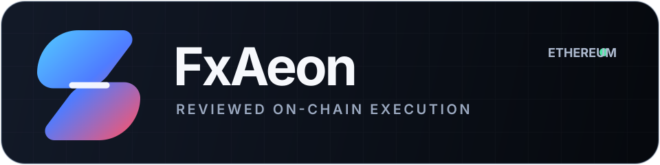

  <h3>A focused, self-custodial interface for f(x) Protocol.</h3>

  <p>
    Trade positions, mint fxUSD, manage fxSAVE, and bridge across Ethereum and Base<br />
    from the web or Telegram—without handing control of your wallet to an application server.
  </p>

  <p>
    <a href="https://github.com/0xNaeemHassan/FxAeon/actions/workflows/ci.yml"></a>
    <a href="https://github.com/0xNaeemHassan/FxAeon/actions/workflows/e2e-mini-app.yml"></a>
    <a href="https://github.com/0xNaeemHassan/FxAeon/actions/workflows/supply-chain.yml"></a>
    <a href="https://github.com/0xNaeemHassan/FxAeon/actions/workflows/anvil-fork.yml?query=branch%3Amain+event%3Aworkflow_dispatch"></a>
    <a href="LICENSE"></a>
  </p>

  <p>
    
    
    
    
    
  </p>

  <p>
    <a href="https://fxaeon.pages.dev/"></a>
  </p>

  <p>
    <a href="#product">Product</a> ·
    <a href="#security-by-construction">Security</a> ·
    <a href="#architecture">Architecture</a> ·
    <a href="#quick-start">Quick start</a> ·
    <a href="#verification">Verification</a> ·
    <a href="docs/README.md">Documentation</a> ·
    <a href="docs/README.md#user-guide">User guide</a>
  </p>
</div>

---

## Product

FxAeon turns the official f(x) SDK into a focused, reviewable product surface for both ordinary browsers and Telegram Mini Apps. The same static application, wallet boundary, SDK adapter, and transaction policy run in both environments, with a violet-black dark theme, lavender actions, and a read-only in-app `/docs` guide.

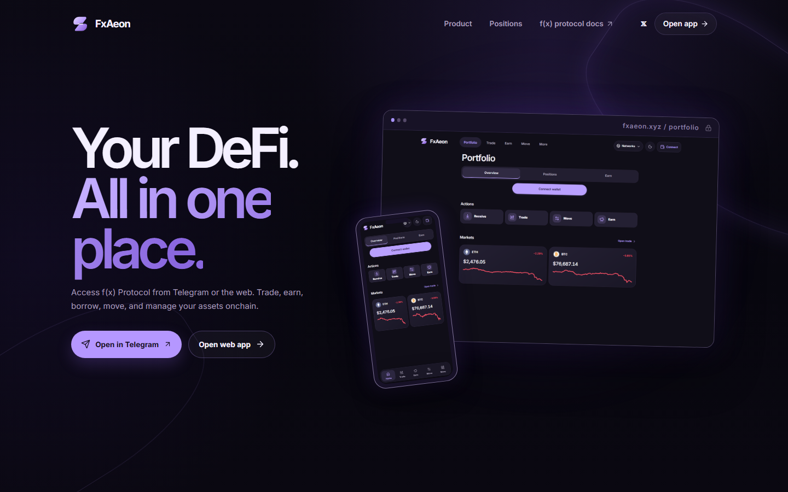

<table>
  <tr>
    <td width="50%" align="center">
      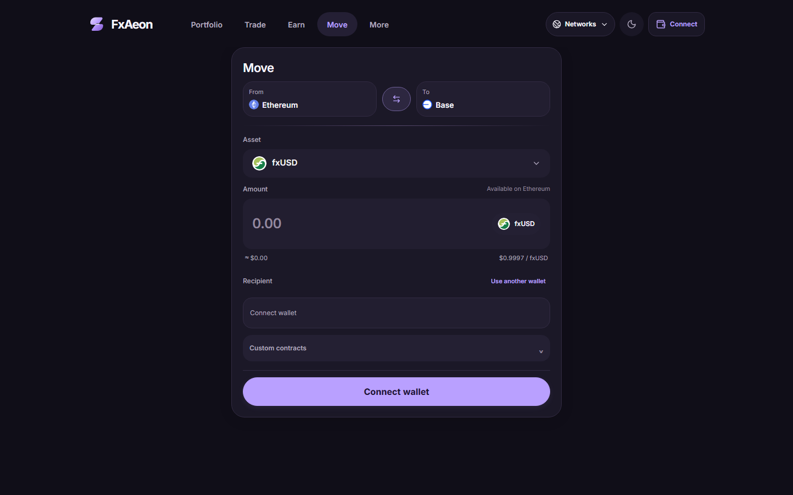
      <br /><strong>Ethereum ↔ Base bridge workflow</strong>
    </td>
    <td width="50%" align="center">
      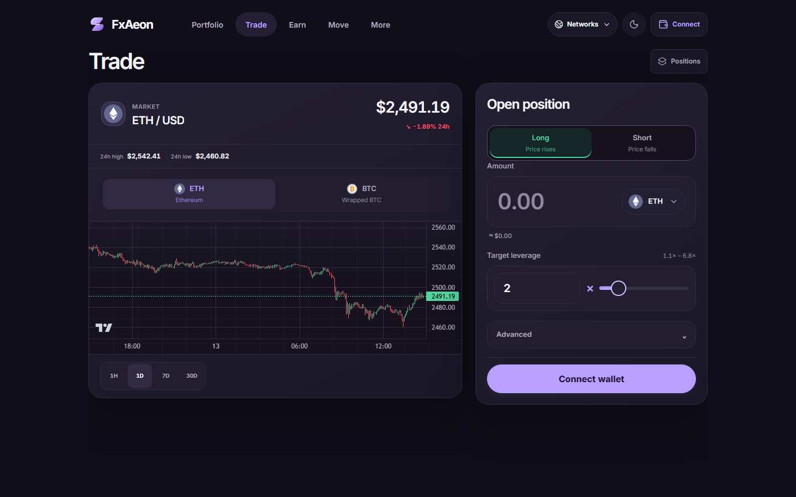
      <br /><strong>Unobstructed trading workspace</strong>
    </td>
  </tr>
  <tr>
    <td width="50%" align="center">
      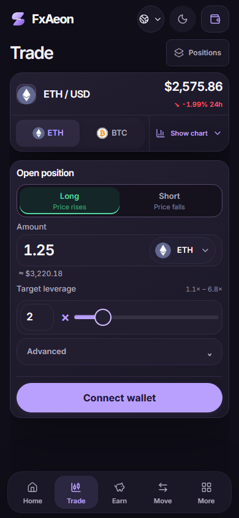
      <br /><strong>Mobile Trade workspace</strong>
    </td>
    <td width="50%" align="center">
      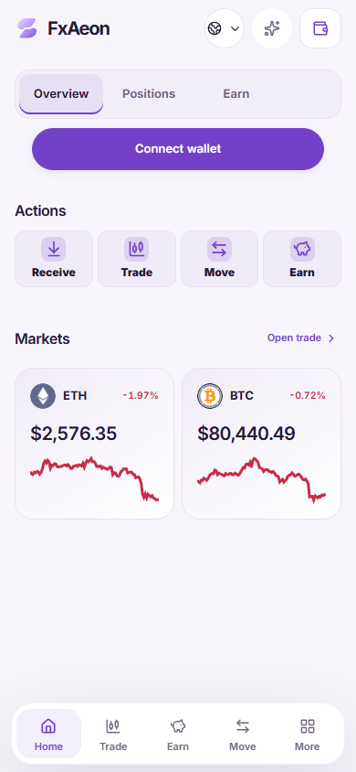
      <br /><strong>Mobile Portfolio · official light</strong>
    </td>
  </tr>
  <tr>
    <td width="50%" align="center">
      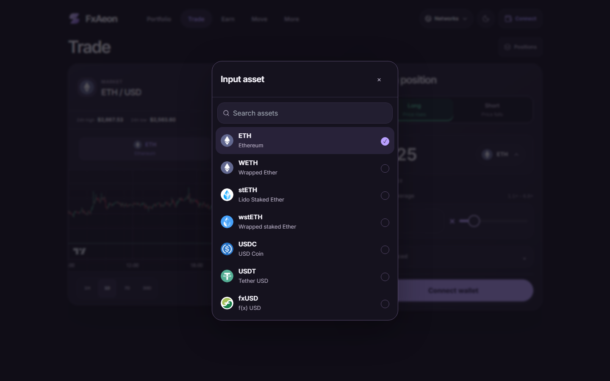
      <br /><strong>Polished token selection</strong>
    </td>
    <td width="50%" align="center">
      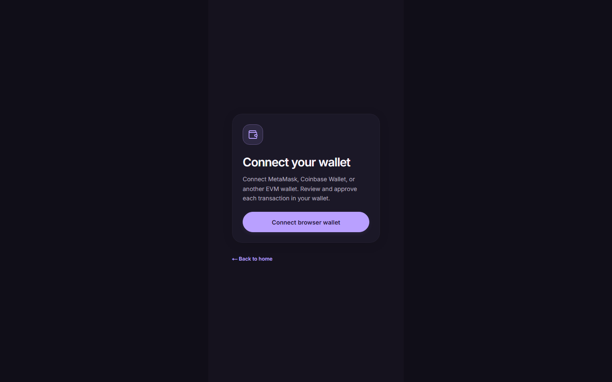
      <br /><strong>Browser wallet entry</strong>
    </td>
  </tr>
  <tr>
    <td width="50%" align="center">
      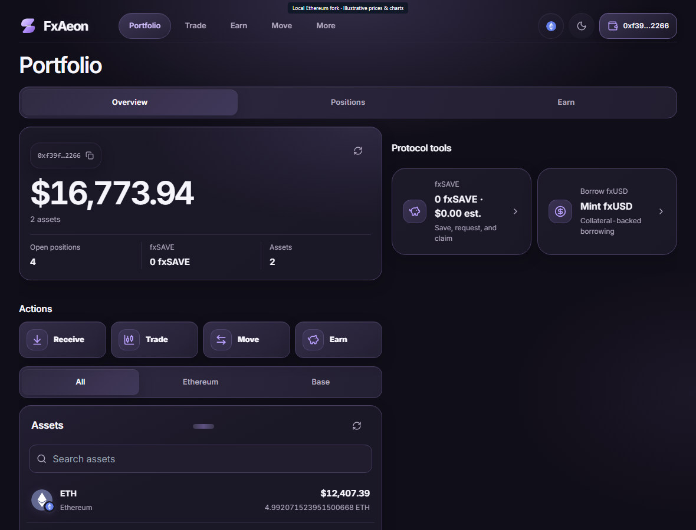
      <br /><strong>Portfolio · verified fork positions</strong>
    </td>
    <td width="50%" align="center">
      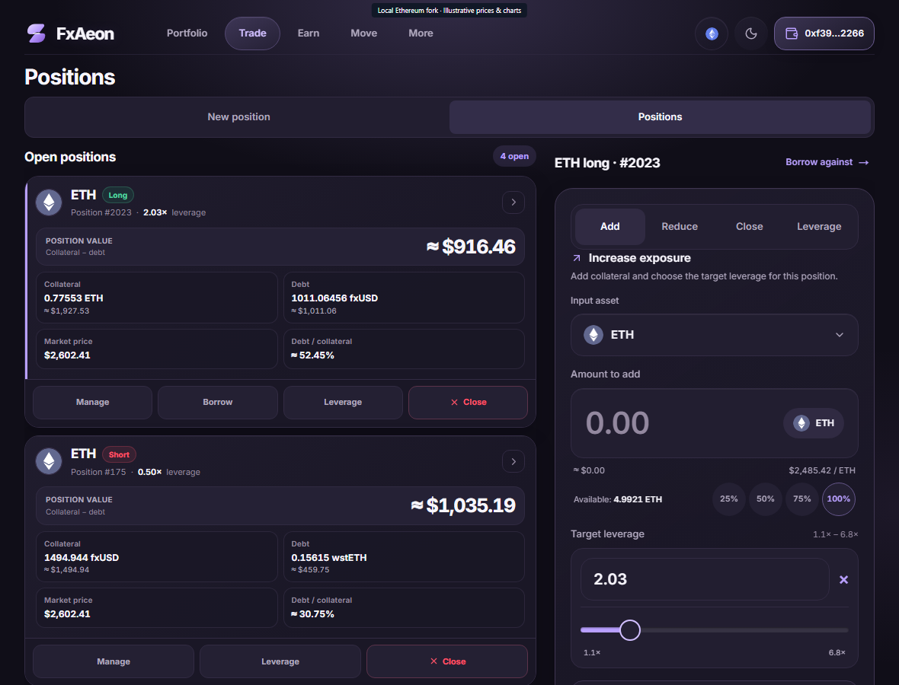
      <br /><strong>Long or short. One position workspace.</strong>
    </td>
  </tr>
</table>

Populated views show positions opened through FxAeon's review and confirmation flow on a disposable Ethereum fork—not production funds. Display prices are unmodified external observations. [Mobile positions](docs/assets/fxaeon-positions-mobile.png) · [Connected Trade](docs/assets/fxaeon-trade-connected.png) · [Capture provenance](docs/position-screenshot-fixture.md).

### A complete, deliberately scoped protocol interface

| Capability | What FxAeon provides |
| --- | --- |
| Positions | Read ETH/BTC long and short positions; open, increase, reduce, close, and adjust leverage |
| Borrow | Deposit collateral and mint fxUSD; repay debt and withdraw collateral |
| fxSAVE | Read balances/configuration, deposit assets, queue or execute redemptions, and claim completed withdrawals |
| Bridge | Quote and build Ethereum ↔ Base LayerZero routes with source-receipt and destination-GUID verification |
| Live USD context | Timestamp- and confidence-validated current asset prices across forms, pickers, Portfolio, Earn, positions, and the wallet profile, plus validated ETH/BTC market history for charts; display-only and never an execution input |
| Wallet profile | Privy embedded wallets or browser-injected EVM wallets, supported-asset balances, live USD totals, and dedicated activity—without a custody server |
| Recovery | Reload-safe pending transaction and bridge journals in a dedicated Activity view, always revalidated against chain data |
| Interface | Mobile-first controls, searchable token pickers with available quantities and their USD worth, a real leverage slider, and one-tap official light/dark theming |

The immutable public surface contains exactly 15 SDK methods. [`fx-scope.lock.json`](fx-scope.lock.json) and the scope verifier prevent protocol internals, unsupported routes, or backend authority from silently entering the product.

Token and network marks use maintained AladdinDAO/SmolDapp assets (with local SVG fallbacks), so fxUSD, fxSAVE, ETH, WETH, stETH, wstETH, USDC, USDT, BTC, Ethereum, and Base remain recognizable even when an asset host is unavailable.

### Why the design matters

- **Web and Telegram parity.** Users can launch the full app in a modern browser or inside Telegram; Telegram is an enhanced host, not a requirement.
- **Self-custodial execution.** Privy or the connected external wallet remains the only signing authority. FxAeon never accepts a private key.
- **Official planning path.** Protocol reads and unsigned transaction plans come from the pinned <code>@aladdindao/fx-sdk</code> package.
- **Chain-authoritative state.** Ethereum, Base, receipts, and matching LayerZero events establish financial truth—not a database or browser cache.
- **Price context without price authority.** DefiLlama supplies the primary validated current-price snapshot; a bounded CoinGecko contract-price fallback can fill independently validated missing token quotes. Quotes older than 15 minutes are rejected and no stablecoin peg is substituted. CoinGecko separately supplies validated ETH/BTC history for the 1D/7D/30D charts. Invalid data is rejected; a failed current-price refresh retains the last validated snapshot with a stale label. These display feeds remain isolated from SDK planning, validation, simulation, and signing.
- **Inspectable transaction review.** Targets, selectors, values, approvals, chains, nonces, and route order are validated before wallet confirmation.
- **Static delivery.** The production artifact is a deterministic Cloudflare Pages export with no application server, Worker, queue, or privileged runtime.

## Security by construction

Every write follows the same guarded lifecycle:

1. build a fresh plan from current wallet, chain, and form inputs;
2. bind it to the selected sender and supported network;
3. validate destinations, selectors, calldata shape, value, approvals, nonce, and order;
4. simulate the ordered calls when supported;
5. show a human-readable and raw transaction review;
6. request a visible wallet confirmation for each step;
7. wait for a successful, fingerprint-matching receipt before continuing;
8. wait one additional block and reread authoritative protocol state.

A rejection, revert, timeout, provider inconsistency, or nonce drift stops the route. Bridge source confirmation is never presented as destination delivery.

> [!IMPORTANT]
> FxAeon is unaudited application software for financial transactions. Review the transaction details shown by your wallet and use the software at your own risk. See [`SECURITY.md`](SECURITY.md) and [`docs/security.md`](docs/security.md) for the complete security model.

## Architecture

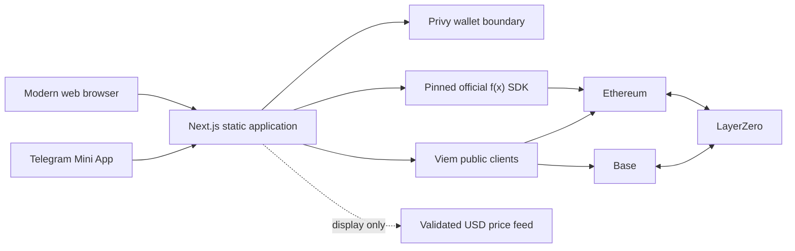
```mermaid
flowchart LR
    WEB[Modern web browser] --> APP
    TG[Telegram Mini App] --> APP[Next.js static application]
    APP --> PRIVY[Privy wallet boundary]
    APP --> SDK["Pinned official f(x) SDK"]
    APP --> VIEM[Viem public clients]
    APP -. display only .-> USD[Validated USD price feed]
    SDK --> ETH[Ethereum]
    VIEM --> ETH
    VIEM --> BASE[Base]
    ETH <--> LZ[LayerZero]
    BASE <--> LZ
```

| Layer | Responsibility |
| --- | --- |
| Interface | Responsive web/Telegram navigation, forms, transaction review, recovery, and accessible states |
| Wallet boundary | Authentication, wallet selection, chain switching, and explicit transaction prompts |
| SDK façade | The exact 15-method official capability contract |
| Policy and runner | Plan binding, validation, simulation, serialization, receipts, and authoritative refresh |
| Chain clients | Restricted Ethereum/Base RPC reads, simulations, receipts, and bridge-event verification |
| Price context | Read-only USD display values with timestamp/confidence validation; never used by execution policy |
| Hosting | Pure static assets with generated CSP hashes and reviewed network destinations |

Read the detailed runtime and state-ownership model in [`docs/architecture.md`](docs/architecture.md).

## Quick start

### Requirements

- Node.js 22
- pnpm 11.19.0 through Corepack

### Install and run

```bash
corepack enable
corepack prepare pnpm@11.19.0 --activate
pnpm install --frozen-lockfile
cp apps/mini-app/.env.example apps/mini-app/.env.local
pnpm dev
```

Open <http://localhost:3000> in a browser. Telegram is optional for local development; use a Telegram test launch only when validating host-specific viewport, theme, haptic, or seamless-login behavior.

### Public build configuration

| Variable | Purpose |
| --- | --- |
| `NEXT_PUBLIC_PRIVY_APP_ID` | Optional public Privy application identifier; omit it to use an injected browser wallet |
| `NEXT_PUBLIC_ALCHEMY_ETHEREUM_RPC_URL` | Origin-restricted Ethereum browser endpoint |
| `NEXT_PUBLIC_ALCHEMY_BASE_RPC_URL` | Origin-restricted Base browser endpoint |
| `NEXT_PUBLIC_TELEGRAM_APP_URL` | Secondary Telegram launch link; browser entry does not depend on it |

Every `NEXT_PUBLIC_*` value is embedded in the browser bundle. Never place a private key, Telegram bot token, Privy secret, authorization key, or unrestricted provider credential in client configuration. Without Privy, FxAeon connects directly to the wallet extension through EIP-1193; signing still happens in that wallet and no fallback server is involved.

See [`SETUP.md`](SETUP.md) for provider restrictions, protected deployment variables, fork-test configuration, and Cloudflare Pages deployment.

## Verification

```bash
pnpm verify
```

The release gate includes:

- exact SDK scope and route-boundary verification;
- ESLint and strict TypeScript checks;
- unit and adversarial money-path tests;
- seeded route and wallet-runner chaos campaigns;
- high-severity production dependency audit;
- static Next.js export and CSP generation;
- bundle-size and forbidden-telemetry inspection; and
- Playwright coverage against the built artifact.

For additional commands:

```bash
pnpm test:chaos   # deterministic mutation and failure-injection campaigns
pnpm test:anvil   # real ETH/BTC long/short positions on a protected mainnet fork
pnpm test:anvil:stress # fast dummy-route transport stress on the fork
pnpm test:anvil:all    # real protocol proof followed by fork stress in one node
pnpm test:anvil:browser # open all four positions through the mobile browser UI
pnpm test:stress  # credential-free chaos plus protected dummy-route fork stress
pnpm test:e2e     # browser and Telegram-sized static-artifact coverage
```

Anvil uses disposable local accounts and snapshots. The default proof funds an unlocked account with fork-only USDC impersonation, opens coexisting ETH/BTC long and short positions through the official SDK, verifies ownership and nonzero pool state, reverts the snapshot, and emits `artifacts/anvil/protocol-proof.json`. Its upstream provider URL is supplied only to the Anvil parent process and is never committed, printed, forwarded to the test child, or written to the proof artifact.

The manual **Protected Anvil mainnet fork** workflow runs three gates: the Node four-position proof, 64 snapshot/revert plus 64 dummy ordered-route stress iterations, and real position opening through the mobile browser UI. The browser gate checks review-before-signing, successful receipts, delayed position discovery, and shared position views across Trade, Positions, Portfolio, Earn, and Move. It also captures the populated interface before restoring the snapshot.

The protected workflow uses the Ethereum Alchemy URL stored in the GitHub environment. A dispatch input or protected `ANVIL_FORK_BLOCK` repository variable can pin the release block. The badge follows the latest completed manual run on `main`: all three gates must pass for this workflow revision to be green. An older green run without the browser step is not browser-execution evidence. See [testing and proof artifacts](docs/testing.md) and [screenshot provenance](docs/position-screenshot-fixture.md).

## Repository structure

```text
apps/mini-app/       Next.js web and Telegram application
brand/               Repository and product identity assets
docs/                Architecture, SDK scope, security, testing, and roadmap
patches/             Reviewed SDK and dependency compatibility patches
scripts/             Scope, environment, CSP, bundle, and fork verification
fx-scope.lock.json   Immutable public SDK capability contract
```

## Documentation

| Guide | Purpose |
| --- | --- |
| [`SETUP.md`](SETUP.md) | Local development, public configuration, testing, and deployment |
| [`CONTRIBUTING.md`](CONTRIBUTING.md) | Contribution workflow, scope rules, and pull-request expectations |
| [`docs/architecture.md`](docs/architecture.md) | Runtime boundaries, transaction lifecycle, and state ownership |
| [`docs/sdk-scope.md`](docs/sdk-scope.md) | Exact official SDK capability contract |
| [`docs/security.md`](docs/security.md) | Threats, controls, supply chain, and residual trust |
| [`docs/testing.md`](docs/testing.md) | Release gates, fork testing, and acceptance matrix |
| [`docs/roadmap.md`](docs/roadmap.md) | Release posture and deliberately deferred work |
| [`SECURITY.md`](SECURITY.md) | Private vulnerability reporting |

## Contributing

Focused security, accessibility, test, and official-capability improvements are welcome. Read [`CONTRIBUTING.md`](CONTRIBUTING.md), preserve the client-only trust boundary, and run `pnpm verify` before opening a pull request.

## License

FxAeon is available under the [MIT License](LICENSE).
