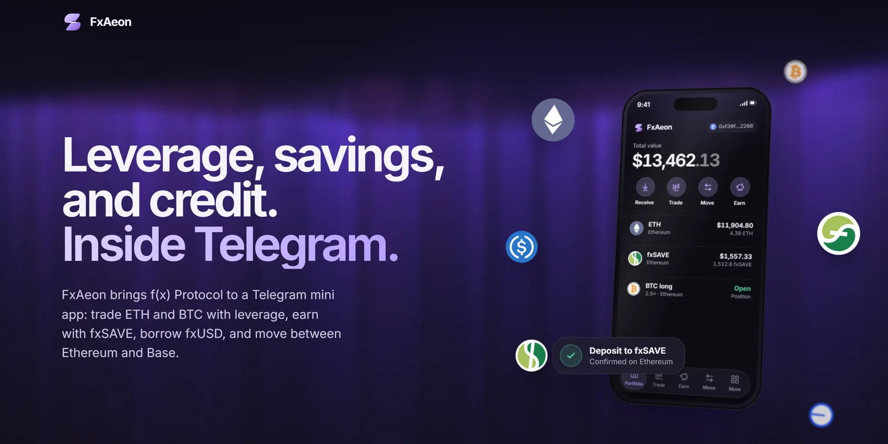
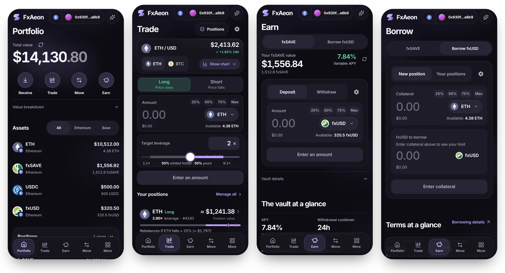
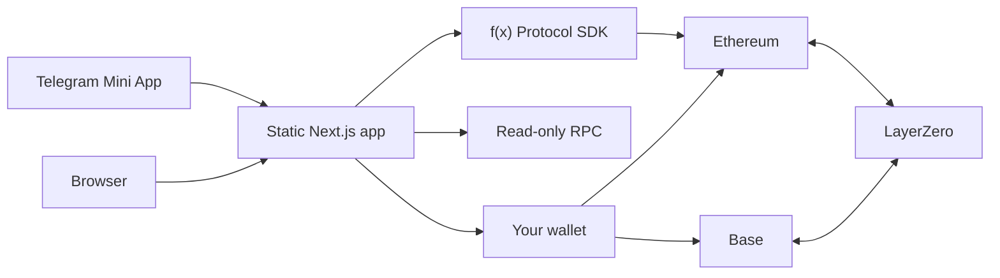

<div align="center">

<a href="https://fxaeon.xyz">
  <picture>
    <source media="(prefers-color-scheme: dark)" srcset="docs/assets/readme/hero-dark.webp">
    <source media="(prefers-color-scheme: light)" srcset="docs/assets/readme/hero-light.webp">
    
  </picture>
</a>

### f(x) Protocol, now inside Telegram.

<a href="https://t.me/FxAeonBot"><b>Open in Telegram</b></a>
&nbsp;·&nbsp;
<a href="https://fxaeon.com">Web app</a>
&nbsp;·&nbsp;
<a href="https://fxaeon.xyz">Website</a>
&nbsp;·&nbsp;
<a href="docs/README.md">Docs</a>

<br>

<a href="https://github.com/fxaeon/FxAeon/actions/workflows/ci.yml"></a>
<a href="https://github.com/fxaeon/FxAeon/actions/workflows/e2e-mini-app.yml"></a>
<a href="LICENSE"></a>

</div>

<br>

FxAeon is a self-custodial Telegram Mini App and web app for [f(x) Protocol](https://fxprotocol.gitbook.io/fx-docs), built on the official [f(x) Protocol SDK](https://github.com/aladdindao/fx-sdk). Every step is simulated and explained before your wallet opens.

<picture>
  <source media="(prefers-color-scheme: dark)" srcset="docs/assets/readme/screens-dark.webp">
  <source media="(prefers-color-scheme: light)" srcset="docs/assets/readme/screens-light.webp">
  
</picture>

<sub>Screens render the real app with sample data.</sub>

## What you can do

<table>
  <tr>
    <td width="50%" valign="top">
      <h4>Trade</h4>
      Go long or short on ETH and BTC with leverage, within the pool's live limits.
    </td>
    <td width="50%" valign="top">
      <h4>Manage positions</h4>
      Add to, reduce, close, or re-lever any position. Each card shows how much is borrowed and how much is yours.
    </td>
  </tr>
  <tr>
    <td valign="top">
      <h4>Earn</h4>
      Deposit into fxSAVE and watch its value compound. Withdraw instantly for a fee, or queue and claim after the cooldown.
    </td>
    <td valign="top">
      <h4>Borrow</h4>
      Borrow fxUSD against ETH or BTC collateral, with your limit shown before you sign. Repay and withdraw the same way.
    </td>
  </tr>
  <tr>
    <td valign="top">
      <h4>Move</h4>
      Bridge fxUSD and fxSAVE between Ethereum and Base over LayerZero. The source and destination are tracked separately.
    </td>
    <td valign="top">
      <h4>History</h4>
      Every transaction reads as the action it was, with exact amounts on demand.
    </td>
  </tr>
</table>

## Built to be trusted

- **Self-custodial.** Your Privy or browser wallet is the only signer. There are no private keys, no server-side signing and no background executor.
- **Checked before signing.** Each route is policy-checked and simulated before a wallet prompt opens. A step that cannot be paid for, or that changed since review, stops first.
- **A locked protocol surface.** The app uses exactly 15 f(x) Protocol SDK methods, pinned in [`fx-scope.lock.json`](fx-scope.lock.json) and [the SDK scope](docs/sdk-scope.md).
- **Honest numbers.** Prices are display context only and never feed planning or signing. Missing data reads as unavailable, never as a guess.

> [!IMPORTANT]
> FxAeon is unaudited application software for financial transactions. Review every request in your wallet. See [`SECURITY.md`](SECURITY.md) and [the security model](docs/security.md).

## How it works


```mermaid
flowchart LR
    TG[Telegram Mini App] --> APP[Static Next.js app]
    WEB[Browser] --> APP
    APP --> SDK["f(x) Protocol SDK"]
    APP --> RPC[Read-only RPC]
    APP --> WALLET[Your wallet]
    SDK --> ETH[Ethereum]
    WALLET --> ETH
    WALLET --> BASE[Base]
    ETH <--> LZ[LayerZero]
    BASE <--> LZ
```

FxAeon is a static client. Protocol reads and transaction plans come from the pinned SDK in the browser, and the user's wallet signs each step after its receipt-verified predecessor.

The only server code is an optional, read-only gas endpoint ([`functions/api/gas.ts`](functions/api/gas.ts)). It cannot plan, sign or change protocol state. Ethereum is authoritative for positions, borrowing and fxSAVE. See [the architecture](docs/architecture.md).

## Quick start

Requires Node.js 22 and pnpm 11.19.0 (through Corepack).

```bash
corepack enable
pnpm install --frozen-lockfile
cp apps/mini-app/.env.example apps/mini-app/.env.local
pnpm dev
```

1. Open <http://localhost:3000>.
2. Add a Privy app ID to sign in with Privy. Without one, an injected EVM wallet still works.
3. Configure restricted Ethereum and Base Alchemy endpoints for protocol reads.

> [!WARNING]
> Every `NEXT_PUBLIC_*` value ships in the browser bundle. Never put signing secrets or a bot token there.

See [SETUP.md](SETUP.md) for every environment variable and [deployment](docs/deployment.md) for Cloudflare Pages.

## Quality bar

```bash
pnpm verify
```

One credential-free command runs the gates every change must pass:

| Group | Gates |
| --- | --- |
| Static checks | SDK scope and architecture contracts, lint, typecheck, frontend secret scan, dependency audit |
| Unit tests | The full unit suite |
| Browser tests | The production build, swept across phone widths, themes and 200% text, plus isolated page harnesses |
| Landing | Contrast measured on painted pixels, and its strict Content-Security-Policy |
| Size | The release bundle budget |

Protected fork tests run real transactions against a local Ethereum fork with disposable accounts, never production funds:

```bash
pnpm test:anvil:all
```

More in [testing](docs/testing.md) and the [browser test gates](docs/browser-test-gates.md).

## Repository

| Path | What lives there |
| --- | --- |
| [`apps/mini-app`](apps/mini-app) | The Telegram Mini App and fxaeon.com: Next.js 15 static export, React 19, Privy, wagmi and viem |
| [`apps/landing`](apps/landing) | fxaeon.xyz: a static site with a WebGL aurora and a strict CSP |
| [`functions/api`](functions/api) | The optional read-only gas endpoint (Cloudflare Pages Function) |
| [`docs`](docs/README.md) | Product, architecture, security, testing and deployment guides |
| [`DESIGN.md`](DESIGN.md) | The Aeon design system: surfaces, themes, motion and responsive rules |

## Documentation

[Setup](SETUP.md) · [Contributing](CONTRIBUTING.md) · [Architecture](docs/architecture.md) · [Security](docs/security.md) · [SDK scope](docs/sdk-scope.md) · [Testing](docs/testing.md) · [Deployment](docs/deployment.md) · [Brand assets](docs/brand-assets.md)

The searchable product guide is also in the app under **More → FxAeon docs**.

## License

[MIT](LICENSE)
