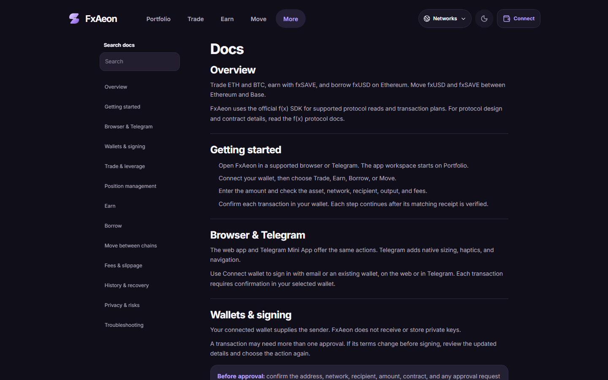

# Documentation

These documents describe the active client-first product and its release process.

## User guide

The client includes a searchable, read-only [`/docs` guide](../apps/mini-app/src/app/docs/page.tsx), available from **More → FxAeon docs** in this revision. It covers getting started, wallet signing, Trade, Earn, Borrow, Move, fees, recovery, and risks. The guide supports the app’s official, neutral-dark, and light themes and needs neither a connected wallet nor Telegram. A local or preview build of this revision is required until it is deployed.

## Engineering references

| Document | Audience | Covers |
| --- | --- | --- |
| [`architecture.md`](architecture.md) | Developers and reviewers | Runtime data flow, module boundaries, and state ownership |
| [`sdk-scope.md`](sdk-scope.md) | Integrators and reviewers | Immutable 15-method f(x) SDK capability contract |
| [`security.md`](security.md) | Maintainers and auditors | Threat model, controls, and residual trust |
| [`testing.md`](testing.md) | Contributors and release operators | Automated, chaos, fork, and manual acceptance gates |
| [`roadmap.md`](roadmap.md) | Product and engineering | Release posture and deliberately deferred work |

Start with [`SETUP.md`](../SETUP.md) for local development or [`CONTRIBUTING.md`](../CONTRIBUTING.md) before changing the repository.

Historical bot, backend, database, automation, alert, referral, analytics, and delegated-signing designs are not active documentation. Git history preserves them for provenance only.
