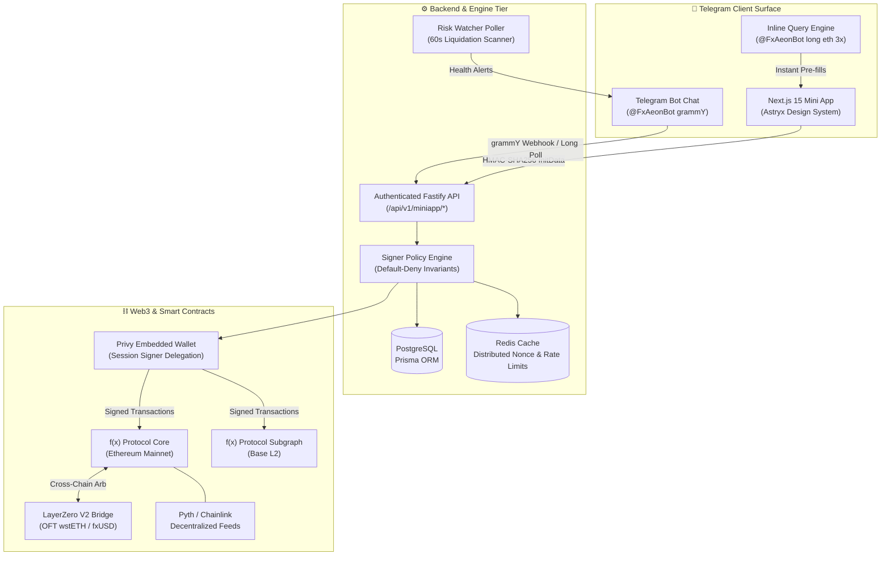

# 🏛️ FxAeon System Architecture & Security Specification

FxAeon is a production-grade Telegram DeFi trading platform engineered for **f(x) Protocol v2** on Ethereum Mainnet and Base. It bridges Telegram WebApp SDK native APIs, embedded non-custodial cryptography (Privy Session Signers), and high-frequency on-chain debt/collateral rebalancing.

---

## 1. System Topology & Component Map



---

## 2. Monorepo Package Hierarchy

The repository is structured as a Turbo monorepo with pnpm workspaces:

```
FxAeon/
├── apps/
│   ├── bot/                # grammY Telegram bot, inline query engine, risk watcher & API server
│   │   ├── src/agent/      # Natural language trade parser & execution intents
│   │   ├── src/miniapp/    # Authenticated Telegram WebApp REST API endpoints
│   │   ├── src/workers/    # Automated background risk watcher & liquidation poller
│   │   └── tests/          # 719 automated Vitest test cases across 70 suites
│   └── mini-app/           # Next.js 15 OLED Trading Terminal & Astryx UI Suite (24 routes)
│       ├── src/app/        # App router routes (trade, portfolio, radar, whales, card, etc.)
│       ├── src/components/ # Astryx UI components, Canvas 2D charts, HoloCard, sound engine
│       ├── src/lib/        # Web Speech announcer, theme switcher, Telegram SDK, i18n
│       └── test/           # 31 unit tests for math, algorithms, and locale catalogs
├── packages/
│   ├── shared/             # Canonical contract addresses, ABIs, risk bounds, and TypeScript types
│   └── db/                 # Prisma client, PostgreSQL schema, and database migration migrations
└── docs/                   # Full professional technical manuals, design specs, and visual assets
```

---

## 3. The 4 Core Architectural Modules

### A. Non-Custodial Session Signer Gate
* **No Raw Private Keys**: Private keys never touch the backend server. Users authenticate via Telegram `initData` validated against the bot's secret key using HMAC-SHA256.
* **Privy Session Delegation**: Users grant an execution session with strict gas allowances and transaction bounds.
* **Default-Deny Policy Engine** ([`apps/bot/src/signerPolicy.ts`](file:///c:/Users/dexen/Downloads/FxAeon-main/FxAeon-main/apps/bot/src/signerPolicy.ts)):
  * Target whitelist: Transactions must strictly target verified f(x) protocol contracts (`Market`, `RebalancePool`, `fxSAVE`, `LayerZeroBridge`).
  * No arbitrary approvals: Zero allowances to unlisted external contracts.
  * Slippage bounded to max 200 bps (2.0%).

### B. Live Canvas 2D Candlestick & Area Trading Chart
* High-performance 60fps HTML5 Canvas renderer with zero heavy third-party bundle weight.
* Multi-interval support (1m, 5m, 15m, 1h, 4h, 1D).
* Real-time WebSocket connection to public price feeds.
* Interactive Take-Profit and Stop-Loss horizontal price lines with instant R:R calculation.

### C. 3D Holographic Gyroscope Engine ([`HoloCard.tsx`](file:///c:/Users/dexen/Downloads/FxAeon-main/FxAeon-main/apps/mini-app/src/components/HoloCard.tsx))
* CSS 3D parallax transform engine combining pointer drag with mobile `DeviceOrientationEvent`.
* 4 holographic foil shaders: Rainbow Chromatic, Giga Gold, Cyber Neon, and Dark Matter Obsidian.
* 1-Tap sharing to Telegram Stories and Chats.

### D. Zero-Cost Client-Side Cyberpunk Voice Announcer ([`announcer.ts`](file:///c:/Users/dexen/Downloads/FxAeon-main/FxAeon-main/apps/mini-app/src/lib/announcer.ts))
* 100% offline text-to-speech using browser `speechSynthesis`.
* 3 switchable personas: Cyberpunk AI, Hype Desk, and Zen Master.
* Real-time audible trading commentary on order executions, TP triggers, and whale movements.
